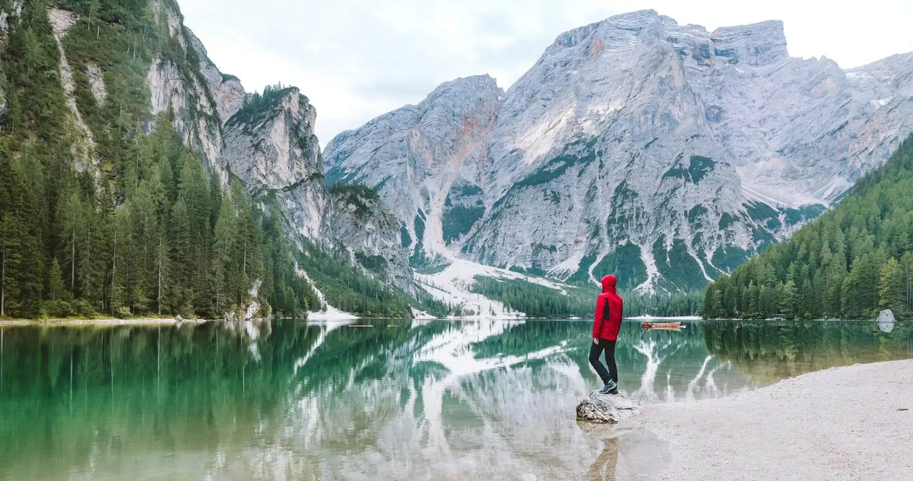
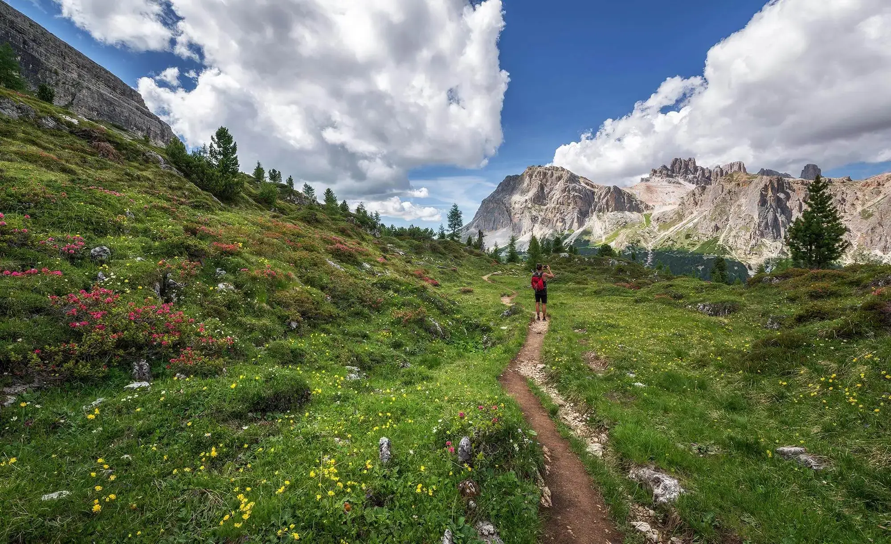
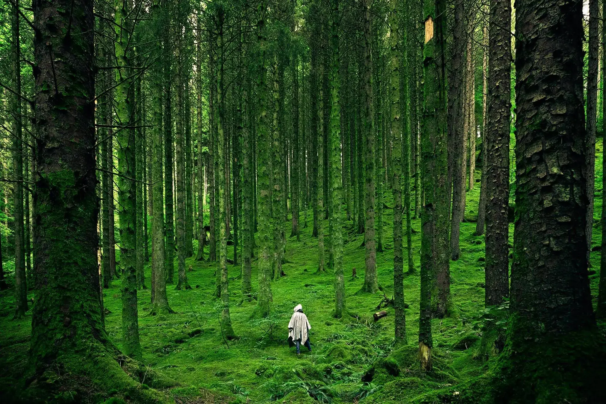
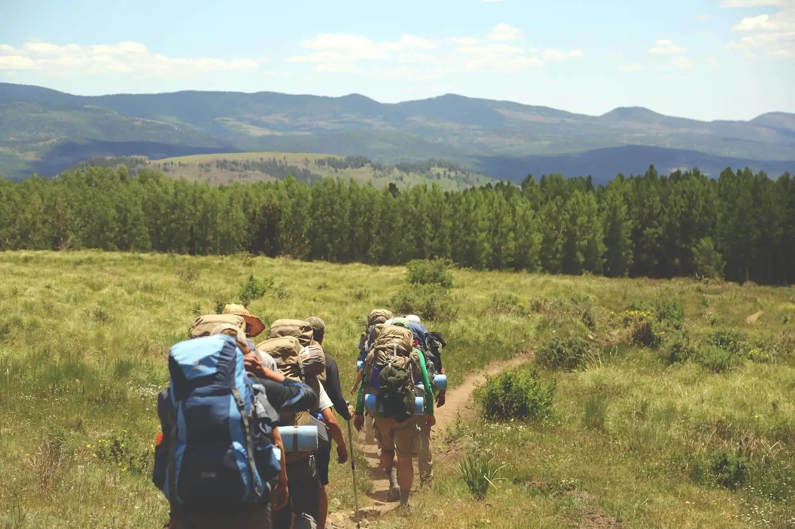
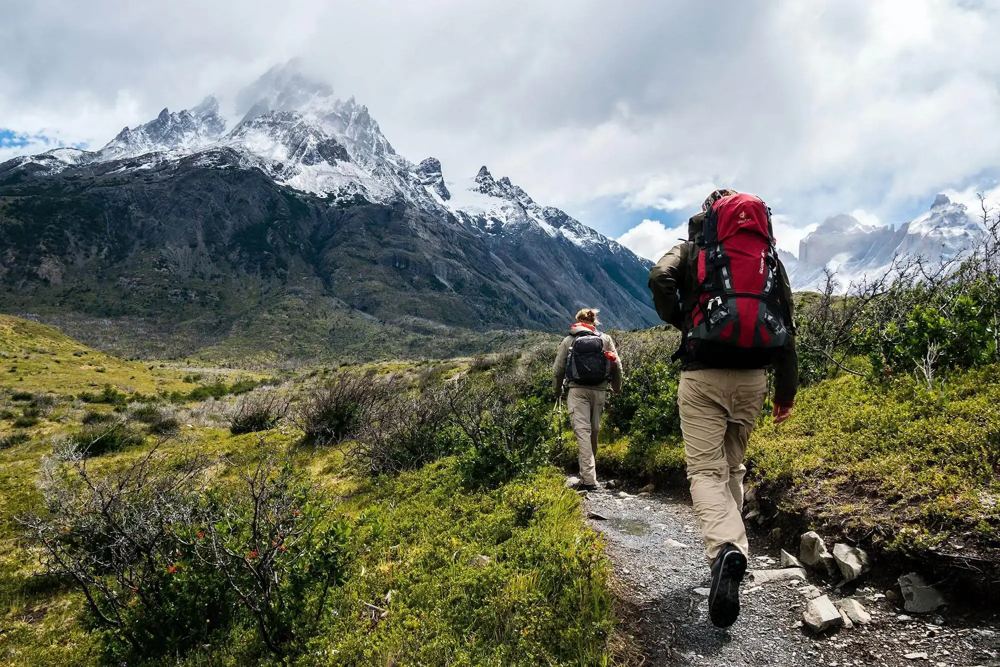
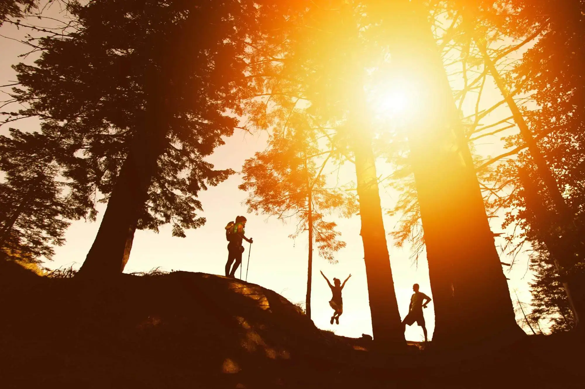

# Summer Of Code Hackathon

# Trail Pals

## Introduction

Welcome to the Trail Pals website. Trail Pals organises hiking events based in Dublin.


<!--  -->

A live website can be found [here](https://gabriele-andolina.github.io/summer-of-code-hackathon/index.html).


# Table of Contents

-   [1. UX](#ux)
    -   [1.1. Strategy](#strategy)
    -   [Project Goals](#project-goals)
    -   [User Goals](#user-goals)
    -   [User Expectations](#user-expectations)
    -   [1.2. Structure](#structure)
    -   [1.3. Skeleton](#skeleton)
    -   [1.4. Design](#design)
-   [2. Features](#features)
-   [3. Technologies Used](#technologies-used)
-   [4. Testing](#testing)
-   [5. Deployment](#deployment)
-   [6. Social Media](#social-media)
-   [7. SEO](#seo)
-   [8. End Product](#end-product)
-   [9. Known Bugs](#known-bugs)
-   [10. Credits](#credits)


# 1. UX
[Go to the top](#table-of-contents)

The main focus for the Trail Pals website was to make it intuitive and easy to navigate. It is targeted at people in the Dublin vicinity. Whether you are an experienced or novice hiker, Trail Pals has a trail for you.


## 1.1. Strategy

[Go to the top](#table-of-contents)

### Project Goals:
-   Responsive design to make the website accessible on different screen sizes.
-   The website design and colours are easy on the eye.
-   The website is catering to accessiblity with it's font, color contrast and descriptions.
### User Goals:
-   As a coder in Dublin, I want to find group meetups to walk together with other coding enthusiasts, so I can promote my well-being and build connections within the community.
-   As a coder in Dublin, I want to explore a map displaying all the trails available in the city, so I can easily find nearby routes and plan my walks conveniently.
-   As a coder in Dublin, I want a user-friendly interface that allows me to filter and search for trails based on location, difficulty level, or specific features, so I can easily discover the perfect trail for my preferences.
-   As a coder in Dublin, I want to access information about each trail, including distance, terrain and notable landmarks, so I can make informed decisions and choose the trails that align with my interests and fitness level.
-   As a coder in Dublin, I want to see upcoming events an walk schedules on the page, so I can plan my time and participate in group meetups that suit my availability.


<!--  -->


### User Expectations:
-   The website should be easy to navigate.
-   The menu is clear.
-   The website is responsive on all devices.
-   The pictures are high quality.
-   The website responds quickly to user requests.

### User Stories

We used the GitHub projects board to manage our project. This ensured that we were on track as we moved issues from to do, to in progress and finally to done.


<!--  -->


## 1.2. Structure

[Go to the top](#table-of-contents)

The website has a responsive design to ensure a pleasant user experience whilst using different devices. The design is simple and user friendly.

- The header, footer and navigation are consistent on all pages.
- The footer is at the bottom of the each page and contains links to social media websites.

## 1.3. Skeleton

[Go to the top](#table-of-contents)

### Wire-frames


<!--  -->


<!--  -->


<!--  -->


## 1.4. Design

[Go to the top](#table-of-contents)

### Colours
- - [](https://mycolor.space/)

### Typography
- [](https://fonts.google.com/specimen/Oswald?query=oswald+)

# 2. Features

[Go to the top](#table-of-contents)

### All Pages
#### Navbar
The Navbar offers up three links to help the user navigate through the site.


<!--  -->

#### Footer
The footer contains social media icons and credits the site owners.


<!--  -->

### Home
- Links.
- Social media icons.


<!--  -->


### Events
#### Carousel
- The carousel is a slideshow for cycling through a series of content, built with CSS and some JavaScript. It works with a series of images, text, or custom markup. It also includes support for previous/next controls and indicators.


<!--  -->


```
<section aria-label="Hike Trails">
        <div class="carousel-container">
            <header class="block__header">
                <h2>Popular hike trails</h2>
            </header>
            <div class="carousel" data-carousel>
                <!-- Carousel pictures -->
                <ul class="carousel-images" data-slides>
                    <li class="carousel-slide" data-active>
                        
                    </li>
                    <li class="carousel-slide">
                        
                    </li>
                    <li class="carousel-slide">
                        
                    </li>
                    <li class="carousel-slide">
                        
                    </li>
                    <li class="carousel-slide">
                        
                    </li>
                    <li class="carousel-slide">
                        
                    </li>
                </ul>
                <!-- Carousel tabs -->
                <ul class="carousel-tabs" data-tabs>
                    <li class="carousel-tab" data-carousel-tab data-index="0" data-active></li>
                    <li class="carousel-tab" data-carousel-tab data-index="1"></li>
                    <li class="carousel-tab" data-carousel-tab data-index="2"></li>
                    <li class="carousel-tab" data-carousel-tab data-index="3"></li>
                    <li class="carousel-tab" data-carousel-tab data-index="4"></li>
                    <li class="carousel-tab" data-carousel-tab data-index="5"></li>
                </ul>
                <!-- Carousel controls -->
                <button class="carousel-button previous" data-carousel-button="previous" aria-label="Previous carousel">
                    <i class="fa-solid fa-chevron-left"></i>
                </button>
                <button class="carousel-button next" data-carousel-button="next" aria-label="Next carousel">
                    <i class="fa-solid fa-chevron-right"></i>
                </button>
                <!-- Carousel text -->
                <ul class="carousel-information" data-information>
                    <li class="carousel-text" data-carousel-text data-index="0" data-active>
                        <p>Trail: #1</p>
                        <p>Trail length: #1</p>
                        <p>Meet Location: #1</p>
                        <p>Date: #1</p>
                        <p>Time: #1</p>
                    </li>
                    <li class="carousel-text" data-carousel-text data-index="1">
                        <p>Trail: #2</p>
                        <p>Trail length: #2</p>
                        <p>Meet Location: #2</p>
                        <p>Date: #2</p>
                        <p>Time: #2</p>
                    </li>
                    <li class="carousel-text" data-carousel-text data-index="2">
                        <p>Trail: #3</p>
                        <p>Trail length: #3</p>
                        <p>Meet Location: #3</p>
                        <p>Date: #3</p>
                        <p>Time: #3</p>
                    </li>
                    <li class="carousel-text" data-carousel-text data-index="3">
                        <p>Trail: #4</p>
                        <p>Trail length: #4</p>
                        <p>Meet Location: #4</p>
                        <p>Date: #4</p>
                        <p>Time: #4</p>
                    </li>
                    <li class="carousel-text" data-carousel-text data-index="4">
                        <p>Trail: #5</p>
                        <p>Trail length: #5</p>
                        <p>Meet Location: #5</p>
                        <p>Date: #5</p>
                        <p>Time: #5</p>
                    </li>
                    <li class="carousel-text" data-carousel-text data-index="5">
                        <p>Trail: #6</p>
                        <p>Trail length: #6</p>
                        <p>Meet Location: #6</p>
                        <p>Date: #6</p>
                        <p>Time: #6</p>
                    </li>
                </ul>
            </div>
        </div>
    </section>
``` 
### Trails
- Google Maps

<!--  -->


```
function initMap() {
    const codeInstitute = { lat: 53.298621297843354, lng: -6.178393105375929 };
    const map = new google.maps.Map(document.getElementById("map"), {
        zoom: 4,
        center: codeInstitute,
    });
    const marker = new google.maps.Marker({
        position: codeInstitute,
        map: map,
    });
}
``` 

# 3. Technologies Used
[Go to the top](#table-of-contents)

-   [HTML5](https://en.wikipedia.org/wiki/HTML)
    -   The project uses HyperText Markup Language.
    (insert Image)
-   [CSS3](https://en.wikipedia.org/wiki/CSS)
    -   The project uses Cascading Style Sheets.
    (insert Image)
-   [JavaScript](https://en.wikipedia.org/wiki/JavaScript)
    -   The project uses JavaScript.
    (insert Image)
-   [Boostrap 4.6](https://getbootstrap.com/docs/4.0/getting-started/introduction/)
    -   The project uses Bootstrap 4.6.
-   [Balsamiq](https://balsamiq.com/)
    -   Balsamiq was used to create the wireframes during the design process.
-   [Google Fonts](https://fonts.google.com/)
    -   Google fonts were used to import the **"Oswald"** font into the style.css file which is used on all pages throughout the project.
-   [GitHub](https://github.com/)
    -   GitHub was used to store the project's code after being pushed from Git.
# 4. Testing

### Responsive Tools
We used [Am I Responsive](http://ami.responsivedesign.is) to validate reponsiveness on different devices.

### W3C Validator Tools

#### HTML:

#### CSS:

#### JavaScript:

### Manual Testing

We have tested the site on different browsers and devices.

-   iPhone X.
-   iPhone XS Max.
-   iPad Pro.
-   MacBook Pro.
-   Safari.
-   Google Chrome.


# 5. Deployment

1. Go to project repositories and select relevant project.
2. Click on the settings option.
3. Scroll down to the Github pages section.
4. Navigate to source section.
5. Click on the dropdown menu select branch and select main.
6. Click save.
7. Once page has refreshed scroll down to get deployed link.
8. Can click on the link to see for validation.

# 6. Social Media Page

<!--  -->

# 7. SEO
To improve the search engine optimisation (SEO) of the website:

- We added keywords in a meta tags to each html file. The keywords were researched using [WordTracker](https://www.wordtracker.com/), there are a number of short-tail and long-tail keywords.

- The list of keywords are as follows:
    - Dublin Coders.
    - Walking meetups.
    - Trail Exploration.
    - well-being promotion.
    - community engagement.
    - Outdoor activities.
    - Dublin Trails.
    - Group Walks.


# 8. End Product

<!--     -->

<!--     -->

<!--  -->

# 9. Known Bugs

# 10. Credits
[Go to the top](#table-of-contents)

### Code

- [](https://learn.codeinstitute.net/)
- [](https://www.youtube.com/)

### Content

- []https:(//mycolor.space/)
- []https:(//fonts.google.com/)


### Project Acknowledgements

- Thanks to all the contributing members of the Coders Cobana Team.
- Thanks to the Code Institute Hackathon Team for their support.


